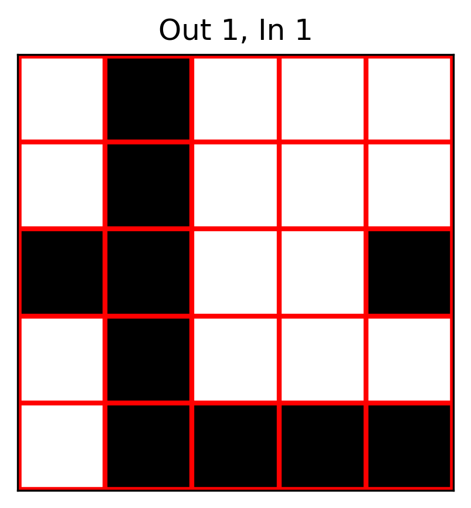

# EMNIST-LOEN

A CNN network designed to implement a single-core, lensless optoelectronic neural network (LOEN) to complete the EMNIST classification task.

Here, we provide different versions of the network architecture. For different sizes of the conv1 convolution kernel, we also perform simulations using **MATLAB** and **TracePro**.

## EMNIST-LOEN-Lite

****Features****

The conv1 layer of the CNN network uses a **3×3 binarized convolution kernel**, corresponding to a physical entity as a black-and-white mask template.  

  

The network has approximately **76k parameters**, low computational complexity, and a test accuracy of about **92%**, making it suitable for embedded development and microcontroller integration.

## EMNIST-LOEN-Plus

****Features****

The conv1 layer of the CNN network uses a **5×5 binarized convolution kernel**, corresponding to a physical entity as a black-and-white mask template.  

  

The network has approximately **300K parameters**, which is relatively small compared to traditional CNNs. Depthwise separable convolutions are introduced to reduce computational cost, while the **SE module** and **spatial attention mechanism** enhance the model's classification performance.

****Training and Performance****

The dataset is divided into training, validation, and test sets.  

During training, **OneCycleLR** is used as the learning rate scheduler, employing a **cosine annealing strategy** to accelerate convergence and improve generalization. The **AdamW optimizer** is applied to ensure more stable weight updates.  Additionally, a **best model saving strategy** is implemented—only saving the model when validation accuracy improves, preventing performance degradation.  

On the test set, the model achieves a classification accuracy of **over 93.5%**. 🚀

## Usage

0. Open the **EMNIST_LOEN** folder and find different versions of EMNIST_LOEN.
1. Run the `load_emnist.py` script to download the EMNIST dataset.  
2. Run the `cnn.py` script to build the network.  
3. Run the `train.py` script to train the model.  
4. Run the `test.py` script to evaluate the model's classification performance using the test set and obtain an image of the `conv1` convolutional kernel.
