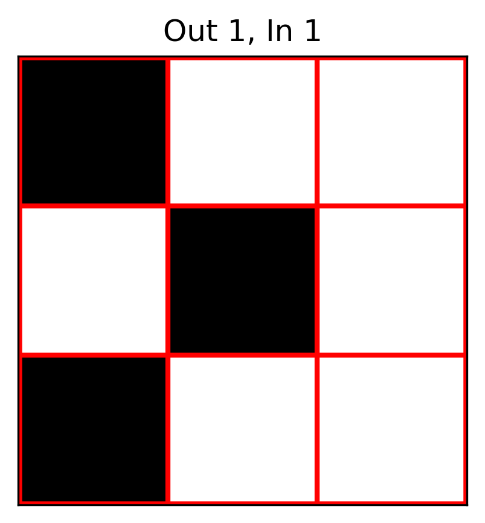

# EMNIST-LOEN-Lite
A CNN network designed to achieve a single-kernel lensless opto-electronic neural network(LOEN).

****Features****

The conv1 layer of the CNN network uses a 3×3 binarized convolution kernel, corresponding to a physical entity as a black-and-white mask template.  

The network has approximately 70k parameters, resulting in low computational complexity, making it suitable for embedded development and microcontroller integration.

****Usage****

1. Run the `load_emnist.py` script to download the EMNIST dataset.  
2. Run the `cnn.py` script to build the network.  
3. Run the `train.py` script to train the model.  
4. Run the `test.py` script to evaluate the model's classification performance using the test set and obtain an image of the `conv1` convolutional kernel.

