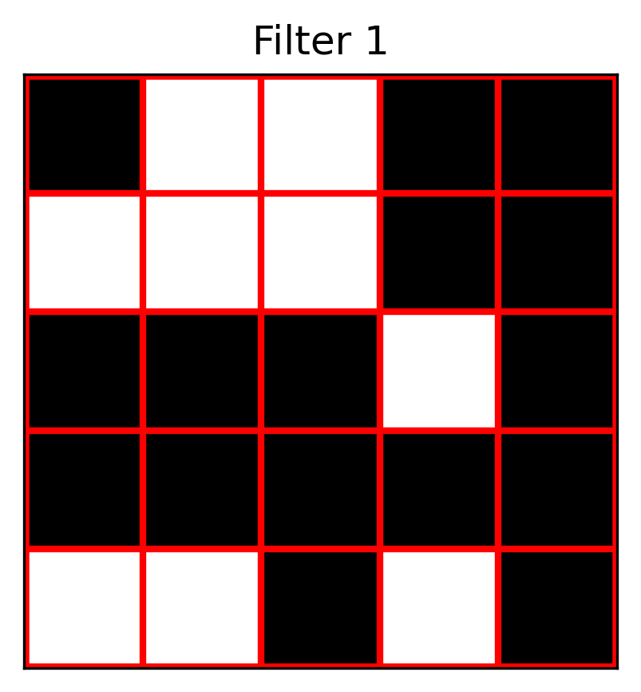
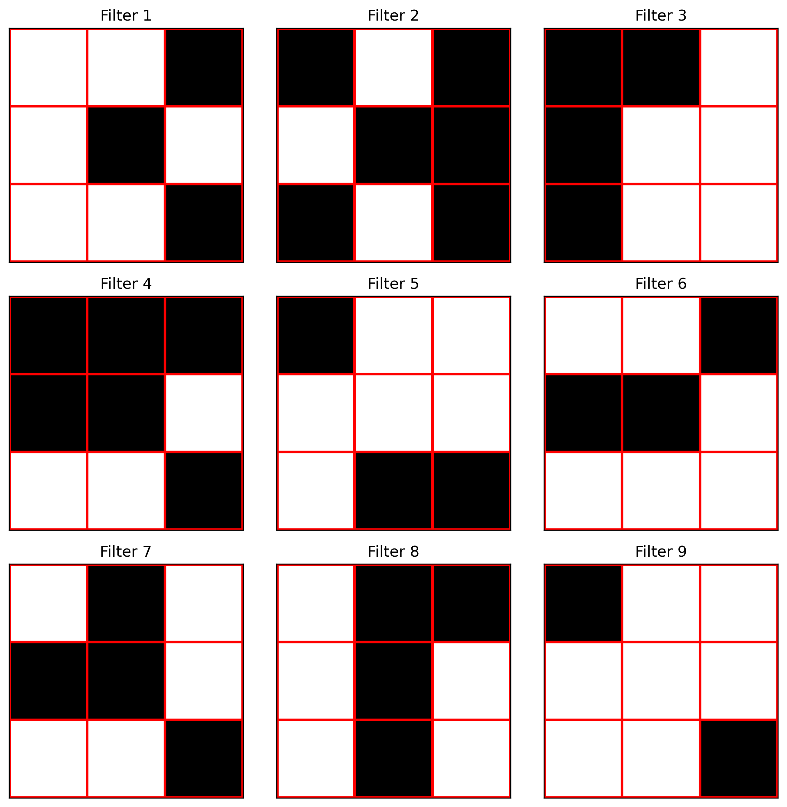
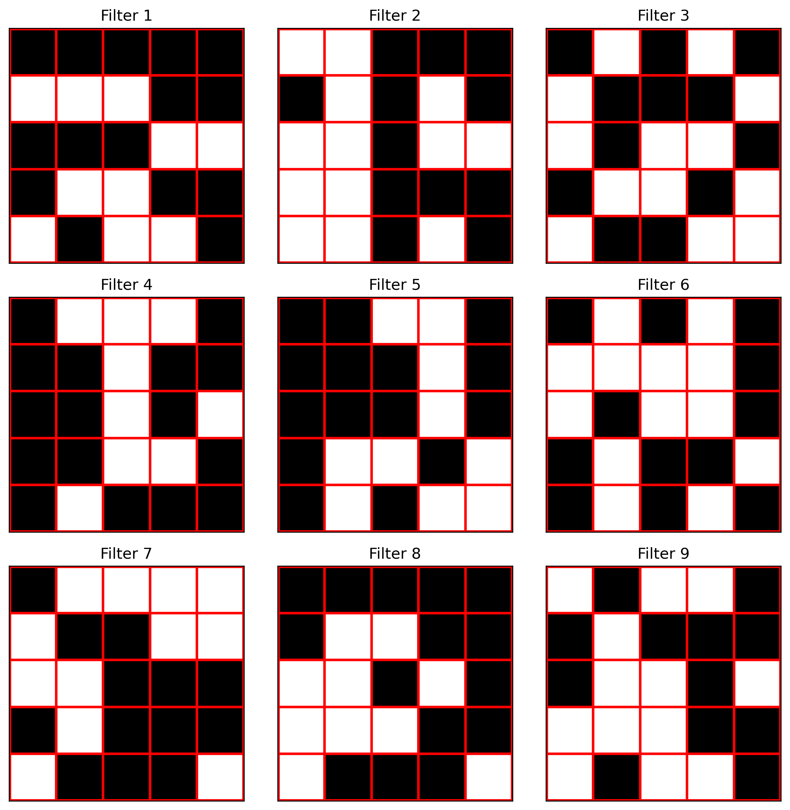

# EMNIST-LOEN

A CNN network designed to implement a single-core, lensless optoelectronic neural network (LOEN) to complete the EMNIST classification task.

Here, we provide different versions of the network architecture. For different sizes of the conv1 convolution kernel, we also perform simulations using **MATLAB** and **TracePro**.

## Usage

0. Open the **EMNIST_LOEN** folder and find different versions of EMNIST_LOEN.
1. Run the `load_emnist.py` script to download the EMNIST dataset.  
2. Run the `cnn.py` script to build the network.  
3. Run the `train.py` script to train the model.  
4. Run the `test.py` script to evaluate the model's classification performance using the test set and obtain an image of the `conv1` convolutional kernel.

## EMNIST-LOEN-Alpha

****Features****

The conv1 layer of the CNN network uses a **3×3 binarized convolution kernel**, corresponding to a physical entity as a black-and-white mask template.  

  

The network has approximately **76k parameters**, low computational complexity, and a test accuracy of about **92%**, making it suitable for embedded development and microcontroller integration.

## EMNIST-LOEN-Beta

****Features****

The conv1 layer of the CNN network uses a **5×5 binarized convolution kernel**, corresponding to a physical entity as a black-and-white mask template.  

  

The network has approximately **300K parameters**, which is relatively small compared to traditional CNNs. Depthwise separable convolutions are introduced to reduce computational cost, while the **SE module** and **spatial attention mechanism** enhance the model's classification performance.

****Training and Performance****

The dataset is divided into training, validation, and test sets.  

During training, **OneCycleLR** is used as the learning rate scheduler, employing a **cosine annealing strategy** to accelerate convergence and improve generalization. The **AdamW optimizer** is applied to ensure more stable weight updates.  Additionally, a **best model saving strategy** is implemented—only saving the model when validation accuracy improves, preventing performance degradation.  

On the test set, the model achieves a classification accuracy of **over 93.5%**. 🚀

## EMNIST-LOEN-ELITE

****Features****

The conv1 layer of the CNN network uses a **4-channel 3×3 binarized convolution kernel**, corresponding to a physical entity as a black-and-white mask template.

  

The network has approximately **37.3K parameters**, making it very lightweight.🔥

The computational load of the conv1 layer accounts for **approximately 23.5%** of the network's total computational load. This allows optical convolutions to replace more electrical convolutions.🔥

It simplifies a large number of convolutional and fully connected layers while significantly reducing the number of parameters and computational cost. By incorporating an enhanced attention mechanism that combines **channel attention** and **spatial attention**, the network can better focus on important channels and spatial regions in the input features, thereby improving model performance.

****Training and Performance****

The ELITE version retains the training adjustment mechanism of the Beta version and achieves an accuracy of **over 92% (92.21%)** on the test set.

## EMNIST-LOEN-PRO

****Features****

The conv1 layer of the CNN network uses a **9-channel 3×3 binarized convolution kernel**, corresponding to a physical entity as a black-and-white mask template.

  

The network has approximately **79.0K parameters**.

The computational load of the conv1 layer accounts for **approximately 14.9%** of the network's total computational load.

Aside from the conv1 layer, the PRO CNN architecture is the result of fine-tuning parameters of the ELITE version.

****Training and Performance****

The PRO version retains the training adjustment mechanism of the Beta version and achieves an accuracy of **over 93% (93.14%)** on the test set.

## EMNIST-LOEN-ULTRA

****Features****

The conv1 layer of the CNN network uses a **9-channel 5×5 binarized convolution kernel**, corresponding to a physical entity as a black-and-white mask template.

  

The network has approximately **154.4K parameters**.

The computational load of the conv1 layer accounts for **approximately 19.4%** of the network's total computational load.

Aside from the conv1 layer, the ULTRA CNN architecture is the result of fine-tuning parameters of the ELITE version.

****Training and Performance****

The ULTRA version retains the training adjustment mechanism of the Beta version and achieves an accuracy of **93.77%** on the test set.
